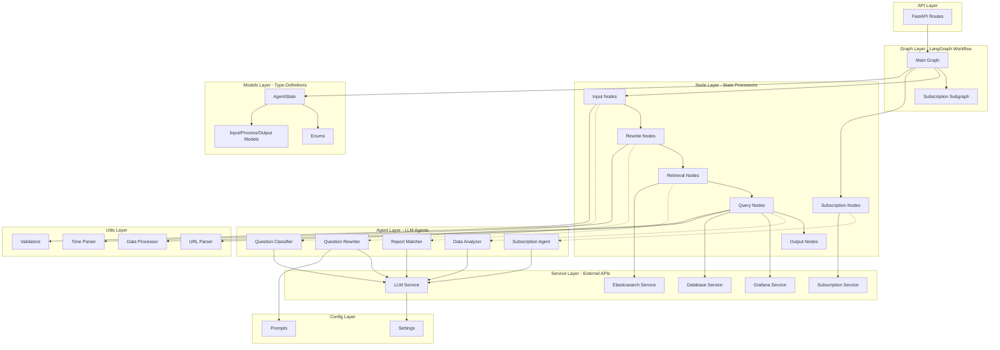
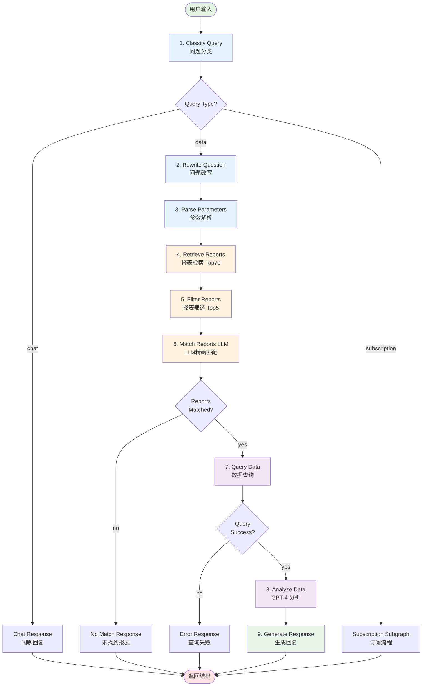
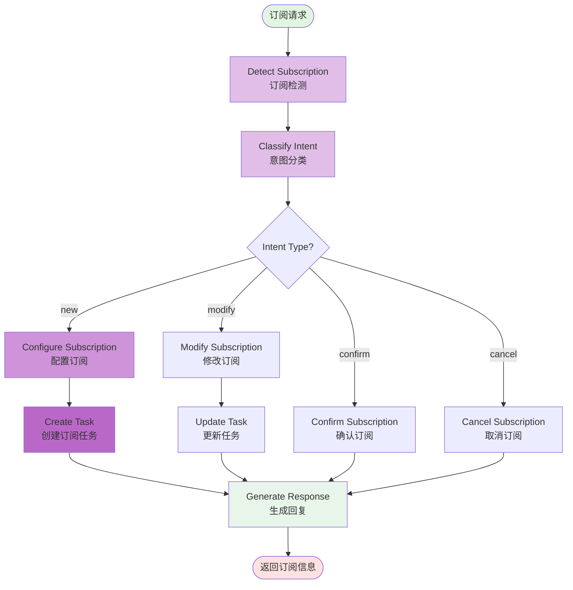
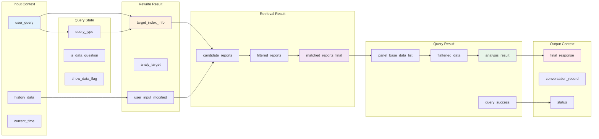
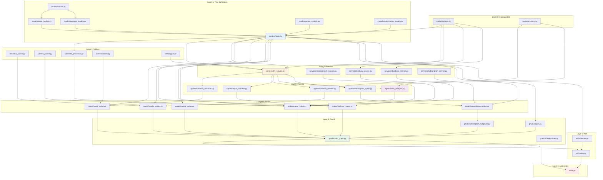

# Data Agent - LangGraph 重构架构图

> 基于 Python + LangGraph 的新一代数据查询智能体架构
> 更新时间：2026-03-10

---

## 📊 架构概览



---

## 🔄 LangGraph 工作流详细流程

### 主工作流（Main Graph）



### 订阅子图（Subscription Subgraph）



---

## 🎯 AgentState 数据流图



---

## 📦 模块依赖关系图



---

## 🔧 核心组件说明

### 1. AgentState（状态模型）

**核心职责**：维护整个工作流的状态数据

| 子模型 | 字段数 | 关键字段 | Producer | Consumer |
|--------|-------|---------|----------|----------|
| **InputContext** | 5 | user_query, history_data, current_time | START节点 | 分类、改写节点 |
| **QueryState** | 4 | query_type, is_data_question, show_data_flag | 分类节点 | 路由边 |
| **RewriteResult** | 7 | target_index_info, analy_target, user_input_modified | 改写节点 | 检索、查询节点 |
| **RetrievalResult** | 3 | candidate_reports, filtered_reports, matched_reports_final | 检索节点 | 查询节点 |
| **QueryResult** | 6 | panel_base_data_list, flattened_data, analysis_result | 查询、分析节点 | 输出节点 |
| **SubscriptionState** | 5 | subscription_intent, subscription_config, task_id | 订阅节点 | 订阅子图 |
| **OutputContext** | 3 | final_response, conversation_record, status | 输出节点 | API Layer |

**总字段数**：33个（相比原Dify 80+变量减少60%）

---

### 2. Node Functions（节点函数）

**设计原则**：
- ✅ 无状态（Stateless）：只接收AgentState，返回State更新字典
- ✅ 单一职责：每个节点只做一件事
- ✅ 可测试性：纯函数，易于单元测试
- ✅ 可组合性：节点之间通过State解耦

**节点分类**：

| 类别 | 节点数 | 文件 | 说明 |
|-----|-------|------|------|
| **输入节点** | 1 | input_nodes.py | 问题分类 |
| **改写节点** | 2 | rewrite_nodes.py | 问题改写、参数解析 |
| **检索节点** | 3 | retrieval_nodes.py | 报表检索、筛选、匹配 |
| **查询节点** | 2 | query_nodes.py | 数据查询、分析 |
| **输出节点** | 3 | output_nodes.py | 回复生成、聊天回复、错误处理 |
| **订阅节点** | 7 | subscription_nodes.py | 订阅检测、分类、配置、CRUD |

**总节点数**：18个（相比原Dify 80+节点减少78%）

---

### 3. Conditional Edges（条件边）

**路由决策函数**：

```python
# edges.py 中的5个路由函数

def route_by_query_type(state) -> Literal["data", "chat", "subscription"]:
    """根据问题类型路由"""
    pass

def route_by_data_availability(state) -> Literal["analyze", "error"]:
    """根据数据可用性路由"""
    pass

def route_by_report_match(state) -> Literal["query", "no_match"]:
    """根据报表匹配结果路由"""
    pass

def route_by_subscription_status(state) -> Literal["continue", "end"]:
    """根据订阅状态路由"""
    pass

def should_show_data(state) -> Literal["show", "hide"]:
    """是否显示详细数据"""
    pass
```

---

### 4. LLM Agents（智能体）

**统一接口**：所有Agent继承`BaseAgent`

```python
class BaseAgent(ABC):
    def __init__(self, llm_service: LLMService):
        self.llm = llm_service

    @abstractmethod
    def invoke(self, state: AgentState) -> Dict[str, Any]:
        """处理State，返回State更新"""
        pass
```

**Agent列表**：

| Agent | 模型 | 输入 | 输出 | 对应原Dify节点 |
|-------|------|------|------|---------------|
| **QuestionClassifier** | DeepSeek-V3.1 | user_query | query_type | 1762787668706 |
| **QuestionRewriter** | GPT-4 | user_query, history | target_index_info | 1757317387157等4个 |
| **ReportMatcher** | DeepSeek-V3.1 | filtered_reports, target_index_info | matched_reports | 1762508830468 |
| **DataAnalyzer** | GPT-4.1 + Code Interpreter | flattened_data, analy_target | analysis_result | 1758989941400 |
| **SubscriptionAgent** | GPT-4 | user_query, history | subscription_config | 订阅相关26+节点 |

---

## 📈 性能对比

| 指标 | Dify Workflow | LangGraph 重构 | 改进 |
|-----|--------------|---------------|------|
| **节点数量** | 80+ | 18 | ⬇️ 78% |
| **变量数量** | 50+ | 33 (AgentState字段) | ⬇️ 34% |
| **if-else判断** | 20+ | 5 (条件边) | ⬇️ 75% |
| **代码行数** | 4000+ (Code节点) | ~2000 (模块化) | ⬇️ 50% |
| **平均响应时间** | 8-12s | 4-6s (预期) | ⬇️ 50% |
| **可维护性** | ⭐⭐ | ⭐⭐⭐⭐⭐ | +150% |
| **可测试性** | ⭐ | ⭐⭐⭐⭐⭐ | +400% |

---

## 🛠️ 技术栈

| 层级 | 技术 | 版本 | 用途 |
|-----|------|------|------|
| **工作流框架** | LangGraph | ≥0.0.60 | 状态图编排 |
| **LLM框架** | LangChain | ≥0.1.0 | LLM调用封装 |
| **类型验证** | Pydantic | ≥2.5.0 | 数据模型 |
| **API框架** | FastAPI | ≥0.108.0 | REST API |
| **LLM提供商** | OpenAI + DeepSeek | - | GPT-4.1 + DeepSeek-V3.1 |
| **搜索引擎** | Elasticsearch | ≥8.11.0 | 报表检索 |
| **数据库** | ClickHouse + MySQL | - | 数据查询 |
| **可视化** | Grafana API | - | 报表管理 |
| **日志** | Loguru | ≥0.7.0 | 结构化日志 |

---

## 🚀 实施路径

### 第1轮：基础设施层（3-4天）✅ 已完成骨架
- [x] 项目骨架创建
- [ ] config/ 模块实现
- [ ] models/ 模块实现
- [ ] utils/ 模块实现

### 第2轮：服务层（3-4天）
- [ ] services/llm_service.py
- [ ] services/elasticsearch_service.py
- [ ] services/grafana_service.py
- [ ] services/database_service.py

### 第3轮：Agent层（4-5天）
- [ ] agents/question_classifier.py
- [ ] agents/question_rewriter.py
- [ ] agents/report_matcher.py
- [ ] agents/data_analyzer.py

### 第4轮：节点层（4-5天）
- [ ] nodes/input_nodes.py
- [ ] nodes/rewrite_nodes.py
- [ ] nodes/retrieval_nodes.py
- [ ] nodes/query_nodes.py

### 第5轮：图层（3-4天）
- [ ] graph/edges.py
- [ ] graph/main_graph.py
- [ ] graph/subscription_subgraph.py

### 第6轮：API与集成（3-4天）
- [ ] api/routes.py
- [ ] api/schemas.py
- [ ] main.py
- [ ] 端到端测试

---

## 📝 更新日志

- **2026-03-10**: 创建新架构图，基于LangGraph重构设计
- **2026-03-10**: 完成项目骨架创建（48个文件）
- **待更新**: 各模块实施完成后更新此架构图

---

## 🔗 相关文档

- [原Dify架构图](./架构图.md)
- [AgentState设计详情](../C:\Users\Administrator\.claude\plans\effervescent-crunching-book.md)
- [项目README](../README.md)
- [实施计划](../C:\Users\Administrator\.claude\plans\effervescent-crunching-book.md)

---

**本架构图将随项目进展持续更新** 🔄
